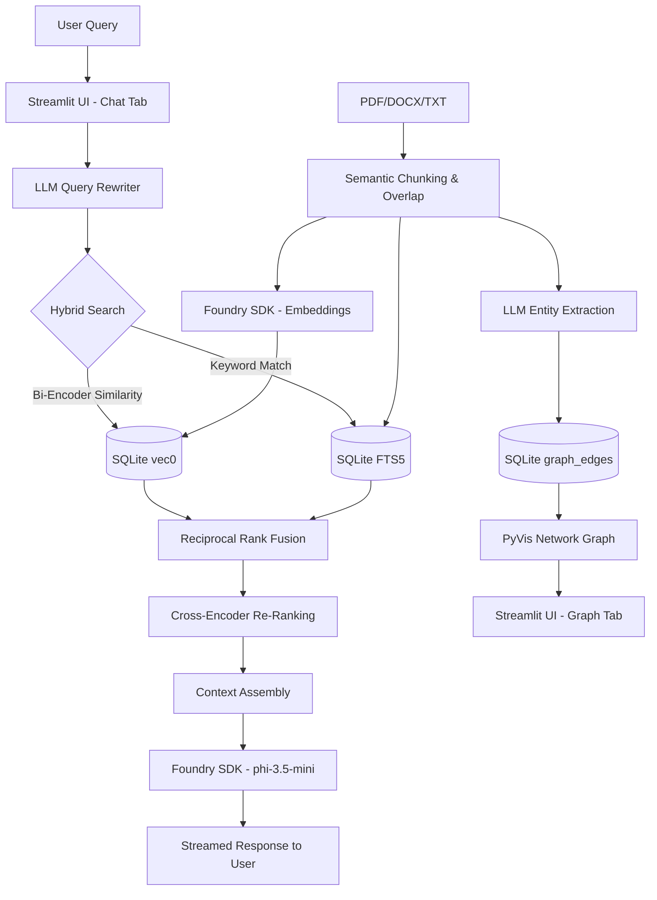

# 🤖 Advanced Local Hybrid Graph-RAG Assistant (Zero Network Calls)

> **🌟 Microsoft AI Innovators Summer Internship Project**  
> *Developed by Şevval Arslan*

This project is a fully local, privacy-first, **Advanced Retrieval-Augmented Generation (RAG)** application integrated with **Graph-RAG** capabilities. It leverages **Microsoft Foundry Local SDK**, **sqlite-vec**, and an enterprise-grade **Multi-Stage Retrieval Pipeline** to run language models, high-performance vector searches, and semantic knowledge graphs entirely on your device, ensuring zero data leaves your local environment.

## ✨ Key Features

- **Zero Network Architecture:** After the initial model download, the application works entirely offline. Absolute privacy for your sensitive documents.
- **Cross-Platform Hardware Awareness:** Foundry Local automatically detects your device's hardware and selects the best execution provider (automatic CPU/GPU/NPU selection on Windows, Mac, and Linux).
- **Knowledge Graph Extraction (Graph-RAG):**
  - Analyzes documents upon upload using the local LLM to extract entities (people, projects, technologies) and their semantic relationships.
  - Generates interactive, 3D, physics-based network graphs (via PyVis & NetworkX) mapping out the conceptual architecture of your data.
- **Multi-Stage Retrieval Pipeline:**
  1. **Query Rewriting:** Uses the local LLM (`phi-3.5-mini`) to dynamically rewrite incomplete or contextless user questions into standalone, searchable queries based on chat history.
  2. **Advanced Hybrid Search (RRF):** Combines standard semantic Vector Search (`sqlite-vec` + `all-MiniLM-L6-v2`) with exact keyword matching via SQLite's Full-Text Search (`FTS5`). Results are intelligently merged using Reciprocal Rank Fusion (RRF).
  3. **Cross-Encoder Re-Ranking:** The retrieved candidates from the hybrid search are passed through a highly accurate Cross-Encoder (`ms-marco-MiniLM-L-6-v2`) for semantic re-ranking, ensuring only the most relevant context is fed to the LLM.
- **Prompt Engineering & Semantic Reasoning:** Implements "Chain of Thought" (CoT) system prompting to give smaller models (like Phi-3.5) powerful logical deduction capabilities, linking synonyms (e.g., "crisis" = "setback") while strictly preventing hallucinations.
- **Context-Collapse Protection:** The system intelligently short-circuits LLM generation if no relevant documents are found, preventing edge-case hallucinations.
- **Dynamic Database Management:** Delete the entire database or drop specific files instantly directly from the UI.
- **Streaming UI:** Watch the AI type out its answers in real-time using a modern **Streamlit** interface, complete with expandable source citations, re-rank scores, and an interactive Graph tab.

## 🏗 Architecture & Stack



- **LLM Runtime:** Microsoft Foundry Local SDK (`phi-3.5-mini`)
- **Embedding Model (Bi-Encoder):** Sentence-Transformers (`all-MiniLM-L6-v2`)
- **Re-Ranking Model (Cross-Encoder):** Sentence-Transformers (`cross-encoder/ms-marco-MiniLM-L-6-v2`)
- **Knowledge Graph Visualization:** PyVis & NetworkX
- **Vector Store:** SQLite with `sqlite-vec`, `FTS5`, and Relational Tables
- **Frontend:** Streamlit
- **Language:** Python

## 🚀 Setup Instructions

1. **Install Dependencies:**
   Ensure you are using your virtual environment (`venv`), then install the required packages:
   ```bash
   pip install -r requirements.txt
   ```

2. **Run the Application:**
   Start the Streamlit application:
   ```bash
   python -m streamlit run app.py
   ```

3. **Using the App:**
   - Upload a PDF or TXT file via the sidebar.
   - Wait for the Hybrid Indexing and Graph Extraction process to complete.
   - **Chat Tab:** Ask follow-up questions and watch the AI dynamically rewrite them, retrieve hybrid context, re-rank it, and stream the answer.
   - **Graph Tab:** Explore the interactive knowledge graph to visually understand the entities and relationships discovered in your documents.

## 📌 Troubleshooting
- **ModuleNotFoundError:** Ensure you are running the `python -m streamlit` command from *within* your activated `venv`.
- **Foundry SDK Singleton Error:** If you encounter `FoundryLocalException` during Streamlit's Hot Reload, simply refresh the web page (F5). The backend handles this gracefully.

## 📄 License
[MIT](LICENSE)
