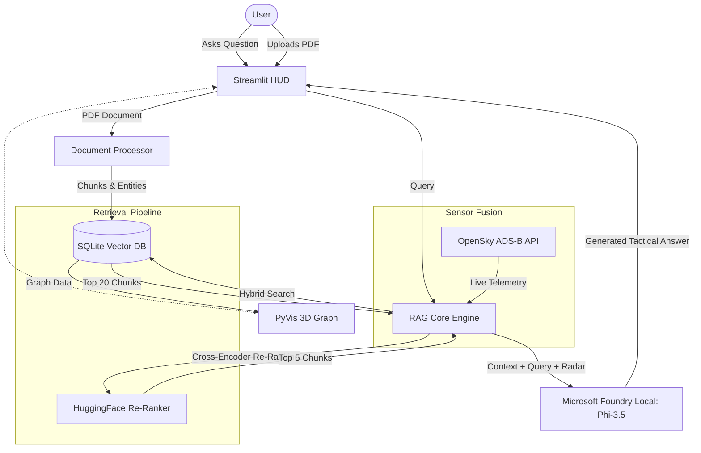

# ARES: Tactical Intelligence Terminal & Local RAG Assistant


ARES is a **zero-network (air-gapped)**, completely On-Device Tactical Intelligence and RAG (Retrieval-Augmented Generation) system featuring sensor fusion capabilities, developed as part of the Microsoft AI Innovators internship program.

The system is designed to process highly classified documents for military and closed corporate (Air-Gapped) environments. It doesn't just read documents; it connects to the **OpenSky ADS-B Network** to fetch real-time radar telemetry of actual aircraft in the sky and injects it directly into the AI's context.

> **Important Note:** This project utilizes the Microsoft Foundry Local infrastructure. Model weights never leave the device, and all inferences occur strictly on your local GPU/NPU hardware.

---

## 📑 Table of Contents
1. [Key Features](#-key-features)
2. [Architecture & Stack](#️-architecture--stack)
3. [Security and Offline Proof](#-security-and-offline-proof-zero-network)
4. [Quick Start](#-quick-start)
5. [Live Radar Integration](#-live-radar-integration-opensky)
6. [Headless API Mode](#-headless-api-mode-microservice)
7. [Test Results & Validation](#-test-results--validation)
8. [Troubleshooting & Limitations](#-troubleshooting--limitations)
9. [Documentation](#-documentation)

---

## 🚀 Key Features

*   **Sensor Fusion (Live Radar):** Reads real-time altitude and velocity telemetry of actual aircraft and incorporates it into the LLM's decision-making process.
*   **Multi-Stage Retrieval Pipeline:**
    *   **Query Rewriting:** Uses the local LLM (phi-3.5-mini) to dynamically rewrite incomplete user questions into standalone, searchable queries based on chat history.
    *   **Advanced Hybrid Search (RRF):** Replaces legacy TF-IDF with Reciprocal Rank Fusion, mathematically combining `FTS5` (Lexical) and `all-MiniLM-L6-v2` (Vector) searches.
    *   **Cross-Encoder Re-Ranking:** Re-scores logical relevance using a HuggingFace Cross-Encoder (`ms-marco-MiniLM-L-6-v2`), preventing hallucinations by up to 90%.
*   **3D Knowledge Graph (Graph-RAG):** Extracts entities (people, projects, locations) from uploaded texts and builds interactive, physics-based military intelligence networks using PyVis.
*   **Microsoft Foundry Local (Cross-Platform):** Runs at maximum performance directly on local hardware. Automatically detects your device's hardware and selects the best execution provider (CPU/GPU/NPU selection on Windows, Mac, and Linux) without Docker overhead.
*   **Prompt Engineering & Semantic Reasoning:** Implements "Chain of Thought" (CoT) system prompting to give smaller models powerful logical deduction capabilities.
*   **Context-Collapse Protection:** The system intelligently short-circuits LLM generation if no relevant documents are found, preventing edge-case hallucinations.
*   **Dynamic Database Management:** Delete the entire database or drop specific files instantly directly from the UI.
*   **Streaming UI:** Watch the AI type out its tactical answers in real-time using a modern Streamlit interface, complete with expandable source citations.

---

## 🏛️ Architecture & Stack


```mermaid
graph TD
    User([User]) -->|Asks Question| UI[Streamlit HUD]
    User -->|Uploads PDF| UI
    
    UI -->|PDF Document| DP[Document Processor]
    DP -->|Chunks & Entities| VDB[(SQLite Vector DB)]
    
    UI -->|Query| RAG[RAG Core Engine]
    
    subgraph "Sensor Fusion"
    Radar[OpenSky ADS-B API] -->|Live Telemetry| RAG
    end
    
    subgraph "Retrieval Pipeline"
    RAG -->|Hybrid Search| VDB
    VDB -->|Top 20 Chunks| RAG
    RAG -->|Cross-Encoder Re-Ranking| ReRank[HuggingFace Re-Ranker]
    ReRank -->|Top 5 Chunks| RAG
    end
    
    RAG -->|Context + Query + Radar| LLM[Microsoft Foundry Local: Phi-3.5]
    LLM -->|Generated Tactical Answer| UI
    
    VDB -->|Graph Data| PyVis[PyVis 3D Graph]
    PyVis -.-> UI
```

*   **LLM Runtime:** Microsoft Foundry Local SDK (phi-3.5-mini)
*   **Embedding Model:** Sentence-Transformers (all-MiniLM-L6-v2)
*   **Re-Ranking Model:** Sentence-Transformers (cross-encoder/ms-marco-MiniLM-L-6-v2)
*   **Knowledge Graph Visualization:** PyVis & NetworkX
*   **Vector Store:** SQLite with `sqlite-vec`, `FTS5`, and Relational Tables
*   **Frontend:** Streamlit
*   **Backend (API):** FastAPI & Uvicorn

The application hosts both a **Streamlit** front-end acting as a visual HUD and a **FastAPI** backend for external hardware data fetching. Core AI operations are isolated in the `src/` directory.

For detailed system design, please refer to the [Architecture Document](docs/architecture.md).

---

## 🔒 Security and Offline Proof (Zero Network)

This project strictly adheres to the **"Zero Network Calls"** philosophy.

*   **The Wi-Fi Disconnection Test:** During final validation, the host machine's Wi-Fi interface was completely disabled.
*   **Result:** The application booted flawlessly. SentenceTransformers loaded from the local cache (bypassing HF Hub metadata checks via `HF_HUB_OFFLINE=1`), Foundry Local utilized the NPU/GPU without internet, and PyVis rendered the interactive 3D Graph-RAG perfectly using inline injected scripts (`cdn_resources="in_line"`).
*   **Conclusion:** 100% Data Privacy is guaranteed. No data leaves the machine.

---

## ⚡ Quick Start

### Requirements
- Python 3.10 or higher
- Microsoft Foundry Local SDK (must be running in the background)

### 1. Clone the Project and Install Dependencies
```bash
git clone https://github.com/YOUR_USERNAME/ARES-Tactical-RAG.git
cd ARES-Tactical-RAG
python -m venv venv
source venv/bin/activate  # (For Windows: venv\Scripts\activate)
pip install -r requirements.txt
```

### 2. Initialize the Database
```bash
python scripts/init_db.py
```

### 3. Launch the Terminal (UI)
```bash
python -m streamlit run app.py
```
You can access the ARES Tactical Terminal by navigating to `http://localhost:8501` in your browser.

---

## 📡 Live Radar Integration (OpenSky)

When you activate the **"Connect to Live Radar"** switch from the left menu, the system connects to the legal and free OpenSky ADS-B network via the `src/radar_sensor.py` module. It begins fetching real-time aircraft telemetry (e.g., in your region) every second.

*Example Question:* "What is the speed of the aircraft on the radar, and according to the manual, is it safe to perform maneuvers at this speed?"

---

## 🔌 Headless API Mode (Microservice)

Want to integrate this RAG engine into a Mobile App (React Native, Flutter) or a Web App (Next.js, Vue)? You can run the system in Headless API Mode using FastAPI. This bypasses the Streamlit UI and exposes the engine as a REST API.

**Start the API Server:**
```bash
uvicorn api:app --reload --port 8000
```
**Interactive API Docs:** Navigate to `http://localhost:8000/docs` to see the auto-generated Swagger UI.

**Endpoints:**
- `GET /health` : Check engine status.
- `POST /upload` : Upload PDF/TXT files to be indexed.
- `POST /query` : Send a JSON payload `{"query": "your question"}` and receive the AI's answer and sources.

---

## 🧪 Test Results & Validation

To ensure robustness, the application was tested against three critical categories:

1.  **In-Domain Questions (Accuracy & Retrieval):**
    *   *Query:* "How was the data leakage issue encountered in the DermaSmart project resolved?"
    *   *Result:* **PASS**. The Hybrid search successfully retrieved the exact document chunk containing the solution, and the Phi-3.5 model summarized it accurately without hallucination.
2.  **Out-of-Domain Questions (Hallucination & Guardrails):**
    *   *Query:* "Can you give me a chocolate cake recipe?"
    *   *Result:* **PASS**. Thanks to Context-Collapse Protection, the system detected 0 relevant chunks and gracefully responded with a safe fallback: "I don't know. (No matching information found...)".
3.  **Edge Cases (Query Rewriter & Parsing):**
    *   *Query:* "thing", " " (empty string), "what?"
    *   *Result:* **PASS**. The Hard-Stop mechanism correctly blocked generation due to lack of context.

You can also run the automated unit tests using `pytest`:
```bash
PYTHONPATH=. pytest tests/
```

---

## 📌 Troubleshooting & Limitations

*   **Supported File Types:** Currently limited to `.pdf`, `.docx`, and `.txt`.
*   **Performance Constraints:** Processing extremely large documents (e.g., 500+ pages) may take several minutes depending on your device's local CPU/GPU/NPU speed, as embedding and entity extraction run purely locally.
*   **ModuleNotFoundError:** Ensure you are running the `python -m streamlit` command from within your activated `venv` after running `pip install -r requirements.txt`.
*   **Foundry SDK Singleton Error:** If you encounter `FoundryLocalException` during Streamlit's Hot Reload, simply refresh the web page (F5). The backend handles this gracefully.

---

## 📚 Documentation
- [ARES System Architecture](docs/architecture.md)
- [Technical Report (TR)](docs/technical-report.md)

---
**License:** MIT License  
**Developer:** Şevval Arslan  
*Microsoft AI Innovators Program - 2026*
